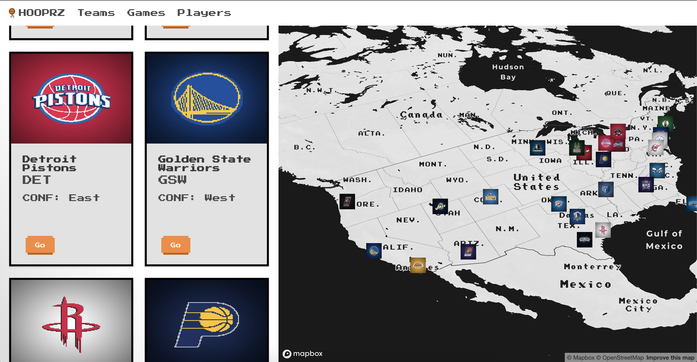

# HOOPRZ

An app for practising React

# Images

I've downloaded images of players using [elhanarinc](https://github.com/elhanarinc/nbaphotocrawler)'s awesome crawler than turn them into 8bit-like images using [pixelator](http://pixelatorapp.com/)

# Backend 

I've implemented a real quick proxy to [ball don't lie API](https://www.balldontlie.io/#introduction) then match the images with players.

This project was bootstrapped with [Create React App](https://github.com/facebook/create-react-app).

### `npm start`

Runs the app in the development mode. 
Open [http://localhost:3000](http://localhost:3000) to view it in the browser.

The page will reload if you make edits. 
You will also see any lint errors in the console.

### `npm run build`

Builds the app for production to the `build` folder. 
It correctly bundles React in production mode and optimizes the build for the best performance.

The build is minified and the filenames include the hashes. 
Your app is ready to be deployed!

See the section about [deployment](https://facebook.github.io/create-react-app/docs/deployment) for more information.

